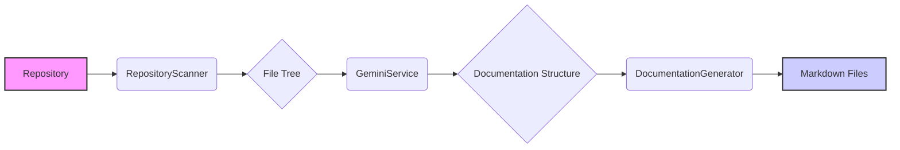

# Project Overview

Provides a high-level overview of the QuickWiki project, its purpose, features, and goals.

## Purpose

QuickWiki is a command-line tool designed to automatically generate documentation for codebases. It leverages the Google Gemini API to analyze code and produce comprehensive documentation in Markdown format. The goal is to provide developers with a fast, efficient, and locally-run solution for documenting their projects, reducing the manual effort typically required.

## Key Features

- **Automated Documentation**: Automatically generates documentation with minimal human input, extracting information directly from the codebase.
- **Architecture Analysis**: Creates architectural overviews and diagrams to visualize the structure of the codebase.
- **Markdown Output**: Generates clean, readable Markdown files that can be easily integrated into existing documentation systems.
- **Local Execution**: Runs locally, ensuring data privacy and control. Requires a [Gemini API key](https://aistudio.google.com/app/apikey).
- **Diagram Generation**: Generates [Mermaid](https://mermaid.js.org/) diagrams for visualizing architecture and workflows.

## How It Works

QuickWiki operates in three main stages:

1.  **Codebase Exploration**: Scans the repository structure and identifies key files using the `tree` command. The [RepositoryScanner](/src/services/repositoryScanner.ts) class is responsible for this.
2.  **Documentation Structure Generation**: Uses the Gemini API to generate a documentation outline with pages and sections.
3.  **Documentation Page Generation**: Creates individual documentation pages using relevant code context, generating diagrams and code explanations. The [DocumentationGenerator](/src/services/documentationGenerator.ts) handles this step.

## Core Components

The system comprises several key components that work together to generate documentation:

- **[RepositoryScanner](/src/services/repositoryScanner.ts)**: Scans the repository file structure and reads file contents.
- **[GeminiService](/src/services/geminiService.ts)**: Handles communication with the Google Gemini API for code analysis and documentation generation.
- **[DocumentationGenerator](/src/services/documentationGenerator.ts)**: Creates and writes Markdown documentation files.
- **[Orchestrator](/src/services/orchestrator.ts)**: Coordinates the entire documentation generation process.

## Example Usage

To generate documentation for a repository, use the following command:

```bash
npx quickwiki-ai /path/to/your/repo
```

This command will analyze the repository at `/path/to/your/repo` and generate documentation in the `wiki` directory within the repository.

## Architecture Diagram



## Goals

The primary goals of QuickWiki are to:

- Automate the documentation process.
- Provide developers with a clear understanding of their codebase.
- Ensure documentation is up-to-date and accurate.
- Make documentation accessible and easy to navigate.
