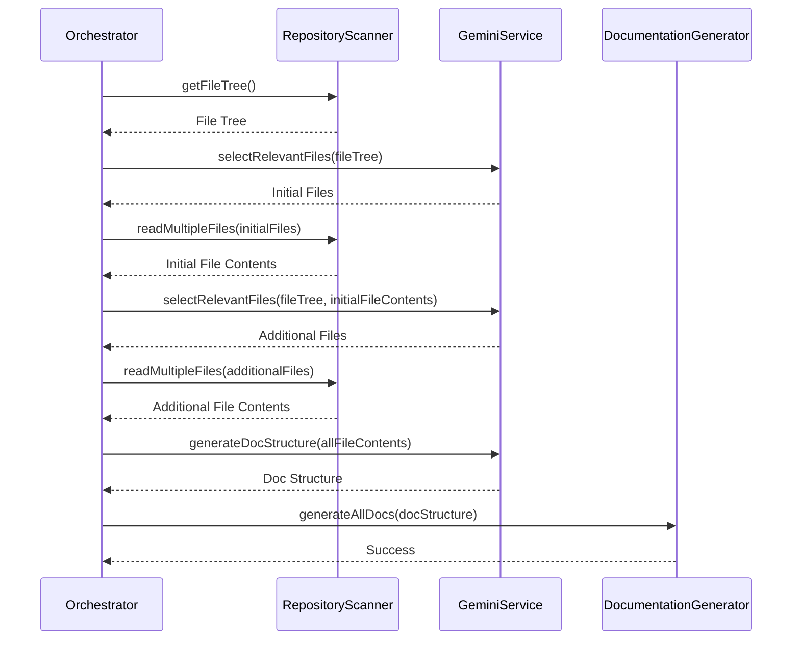

# Component Details
Provides in-depth details about each component within QuickWiki, including their responsibilities, inputs, and outputs.

## Orchestrator
The [Orchestrator](/src/services/orchestrator.ts) class is the main entry point for the documentation generation process. It coordinates the activities of other services to scan the repository, select relevant files, generate a documentation structure, and generate the final documentation pages.

### Responsibilities:
*   Initializing and coordinating other services.
*   Scanning the repository for files.
*   Using the [GeminiService](/src/services/geminiService.ts) to select relevant files and generate the documentation structure and page content.
*   Writing the generated documentation to the output directory.

### Workflow:



### Code Example:

```typescript
// Example of the Orchestrator's run method
async run(): Promise<void> {
  const scanner = new RepositoryScanner(this.repositoryPath);
  const gemini = new GeminiService(this.geminiApiKey);
  const docGenerator = new DocumentationGenerator(this.outputDir, gemini, scanner);

  const fileTree = await scanner.getFileTree();
  const initialFiles = await gemini.selectRelevantFiles(fileTree);
  // ... more steps
}
```

## RepositoryScanner
The [RepositoryScanner](/src/services/repositoryScanner.ts) class is responsible for scanning the repository's file structure and reading file contents. It uses the `tree` command to generate a file tree and `fs` module to read file contents.

### Responsibilities:
*   Generating a tree representation of the repository's file structure using the `tree` command.
*   Reading the content of individual files.
*   Reading the content of multiple files efficiently.

### Input:
*   `repositoryPath`: The path to the repository.

### Output:
*   `getFileTree()`: Returns a string representation of the file tree.
*   `readFileContent(filePath)`: Returns the content of the specified file, or an error message if the file cannot be read.
*   `readMultipleFiles(paths)`: Returns an array of [FileContent](/src/models/types.ts) objects, each containing the path and content of a file.

### Code Example:

```typescript
// Example of reading a single file
async readFileContent(filePath: string): Promise<string> {
  const content = await fs.readFile(filePath, 'utf-8');
  return content;
}
```

## GeminiService
The [GeminiService](/src/services/geminiService.ts) class interfaces with the Google Gemini AI model to generate responses, select relevant files, generate documentation structures, and generate page content.

### Responsibilities:
*   Initializing and authenticating with the Gemini API.
*   Generating responses to prompts using the Gemini AI model.
*   Selecting relevant files from the repository based on the file tree.
*   Generating a documentation structure based on the selected files.
*   Generating the content for individual documentation pages.

### Input:
*   `apiKey`: The API key for the Google Gemini AI model.

### Output:
*   `generateResponse(prompt)`: Returns a string response from the Gemini AI model.
*   `selectRelevantFiles(fileTree)`: Returns an array of file paths that are considered relevant for documentation.
*   `generateDocStructure(fileContents)`: Returns a [DocStructure](/src/models/types.ts) object representing the structure of the documentation.
*   `generatePageContent(pageInfo, relevantFiles)`: Returns the markdown content for a documentation page.

### Code Example:

```typescript
// Example of generating a documentation structure
async generateDocStructure(fileContents: FileContent[]): Promise<DocStructure> {
  const prompt = `Based on your analysis of this codebase...`;
  return await this.generateStructuredResponse<DocStructure>(prompt, responseSchema);
}
```

## DocumentationGenerator
The [DocumentationGenerator](/src/services/documentationGenerator.ts) class is responsible for generating the final documentation files from the documentation structure and page content.

### Responsibilities:
*   Creating the output directory.
*   Generating documentation for each page.
*   Writing the documentation pages to files.
*   Generating an index page that links to all the documentation pages.

### Input:
*   `outputDir`: The directory where the documentation files will be written.
*   `geminiService`: An instance of the [GeminiService](/src/services/geminiService.ts) class.
*   `repositoryScanner`: An instance of the [RepositoryScanner](/src/services/repositoryScanner.ts) class.

### Code Example:

```typescript
// Example of writing a documentation page to a file
private async writeDocPage(pageId: string, content: string): Promise<void> {
  const filePath = path.join(this.outputDir, `${pageId}.md`);
  await fs.writeFile(filePath, content, "utf-8");
}
```