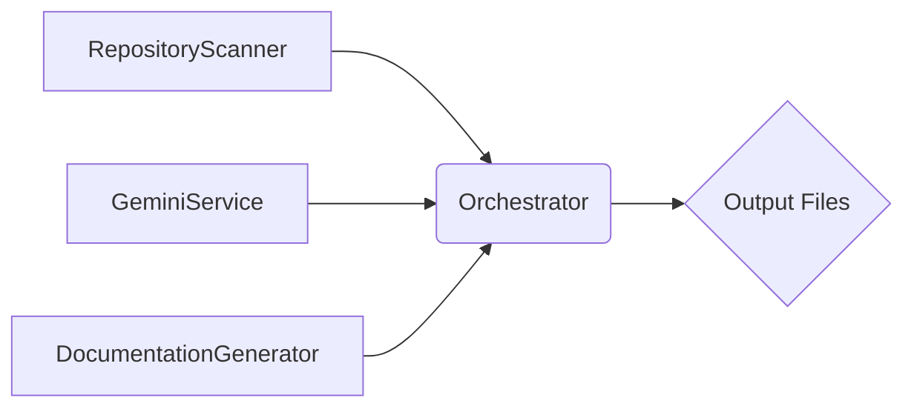

# Architecture

This document explores the technical architecture of QuickWiki, outlining the main components, services, and their interactions.

## High-Level Overview

QuickWiki employs a modular architecture, separating concerns into distinct services. The core components include the [RepositoryScanner](/src/services/repositoryScanner.ts), [GeminiService](/src/services/geminiService.ts), [DocumentationGenerator](/src/services/documentationGenerator.ts), and [Orchestrator](/src/services/orchestrator.ts).



## Component Details

### RepositoryScanner

The [RepositoryScanner](/src/services/repositoryScanner.ts) is responsible for scanning the file system and reading file contents. It uses the `tree` command to generate a file tree, respecting `.gitignore` rules. It also reads the content of specified files, skipping large or binary files.

```typescript
// Example usage of RepositoryScanner
const scanner = new RepositoryScanner("/path/to/repo");
const fileTree = await scanner.getFileTree();
const fileContent = await scanner.readFileContent("/path/to/repo/src/index.ts");
```

### GeminiService

The [GeminiService](/src/services/geminiService.ts) handles communication with the Google Gemini API. It initializes the API client, generates responses based on prompts, and parses structured responses from the API.

```typescript
// Example of generating a response using GeminiService
const gemini = new GeminiService("YOUR_API_KEY");
await gemini.initialize();
const response = await gemini.generateResponse("What is TypeScript?");
```

### DocumentationGenerator

The [DocumentationGenerator](/src/services/documentationGenerator.ts) creates the final markdown documentation files. It uses the [GeminiService](/src/services/geminiService.ts) to generate content for each page and writes the content to files in the output directory.

### Orchestrator

The [Orchestrator](/src/services/orchestrator.ts) coordinates the entire documentation generation process. It initializes the other services, scans the repository, selects relevant files, generates the documentation structure, and generates the documentation pages.

The [Orchestrator.run()](/src/services/orchestrator.ts#L10) method defines the core workflow:

1.  **Repository Scanning:** Uses [RepositoryScanner](/src/services/repositoryScanner.ts) to get the file tree.
2.  **File Selection:** Uses [GeminiService](/src/services/geminiService.ts) to select relevant files based on the file tree.
3.  **Content Generation:** Uses [GeminiService](/src/services/geminiService.ts) to generate the documentation structure and page content.
4.  **Output:** Uses [DocumentationGenerator](/src/services/documentationGenerator.ts) to write the documentation to markdown files.

## Data Flow

1. The [Orchestrator](/src/services/orchestrator.ts) initiates the process by calling [RepositoryScanner.getFileTree()](/src/services/repositoryScanner.ts#L7).
2. The resulting file tree is passed to [GeminiService.selectRelevantFiles()](/src/services/geminiService.ts#L68) to identify key files.
3. The content of these files, obtained via [RepositoryScanner.readMultipleFiles()](/src/services/repositoryScanner.ts#L52), informs the documentation structure, generated by [GeminiService.generateDocStructure()](/src/services/geminiService.ts#L134).
4. Finally, the content for each documentation page is generated via [GeminiService.generatePageContent()](/src/services/geminiService.ts#L194) and saved as markdown by the [DocumentationGenerator](/src/services/documentationGenerator.ts).
