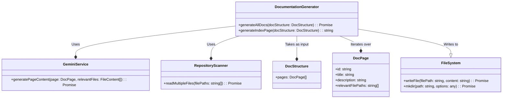

# Documentation Generator

The [DocumentationGenerator](/src/services/documentationGenerator.ts) service takes the output from the [GeminiService](/src/services/geminiService.ts) and writes it to markdown files. It orchestrates the generation of documentation pages based on a provided [DocStructure](/src/models/types.ts) object, handling directory creation, content generation using the LLM, and file writing.

## Architecture

The `DocumentationGenerator` class depends on two main services:

-   [GeminiService](/src/services/geminiService.ts): For generating the actual markdown content of the documentation pages.
-   [RepositoryScanner](/src/services/repositoryScanner.ts): For reading the contents of relevant files from the repository.



## Core Functionality

The primary function of the `DocumentationGenerator` is [generateAllDocs()](/src/services/documentationGenerator.ts#L13), which iterates through the pages defined in the [DocStructure](/src/models/types.ts) and generates a markdown file for each.

1.  **Directory Creation:** It ensures the output directory exists using `fs.mkdir`.  If the directory doesn't exist, it creates it recursively.
2.  **Page Generation:** For each [DocPage](/src/models/types.ts) in the `docStructure`, it calls [generatePageMarkdown()](/src/services/documentationGenerator.ts#L40) to generate the markdown content.
3.  **File Writing:**  It writes the generated markdown content to a file using [writeDocPage()](/src/services/documentationGenerator.ts#L46).
4.  **Index Generation:** Finally, it generates an `index.md` file with links to all generated documentation pages using [generateIndexPage()](/src/services/documentationGenerator.ts#L51).


### Generating Page Markdown

The [generatePageMarkdown()](/src/services/documentationGenerator.ts#L40) method orchestrates the process of creating markdown content for a single documentation page:

1.  **File Reading:** It retrieves the content of the relevant files specified in the [DocPage](/src/models/types.ts) using the [RepositoryScanner](/src/services/repositoryScanner.ts).

    ```typescript
    const relevantFiles = await this.repositoryScanner.readMultipleFiles(page.relevantFilePaths);
    ```

2.  **Content Generation:** It then passes the page definition and the file contents to the [GeminiService](/src/services/geminiService.ts) to generate the markdown content.

    ```typescript
    return await this.geminiService.generatePageContent(page, relevantFiles);
    ```

### Generating the Index Page

The [generateIndexPage()](/src/services/documentationGenerator.ts#L51) method generates the content for the `index.md` file. This file provides a table of contents with links to all the generated documentation pages.

```typescript
  public generateIndexPage(docStructure: DocStructure): string {
    const pages = docStructure.pages;
    let toc = "";
    let topLevelIndex = 1;
    for (let i = 0; i < pages.length; i++) {
      const page = pages[i];
      if (!/\d-\d/.test(page.id)) {
        toc += `${topLevelIndex}. [${page.title}](./${page.id}.md): ${page.description}\n`;
        if (Array.isArray(page.subPages) && page.subPages.length > 0) {
            ...
        }
        topLevelIndex++;
      }
    }
    const indexContent = `# Documentation Index\n\n${toc.trimEnd()}\n`;
    return indexContent;
  }
```

## Error Handling

The `DocumentationGenerator` includes error handling to gracefully manage potential issues during directory creation, content generation, and file writing. It catches exceptions and logs error messages, providing informative feedback on the failure.  For example:

```typescript
    try {
      await fs.mkdir(this.outputDir, { recursive: true });
      console.log(`Created output directory: ${this.outputDir}`);
    } catch (error) {
      if (error instanceof Error) {
        throw new Error(`Failed to create output directory: ${error.message}`);
      }
      throw new Error("Failed to create output directory: Unknown error");
    }
```