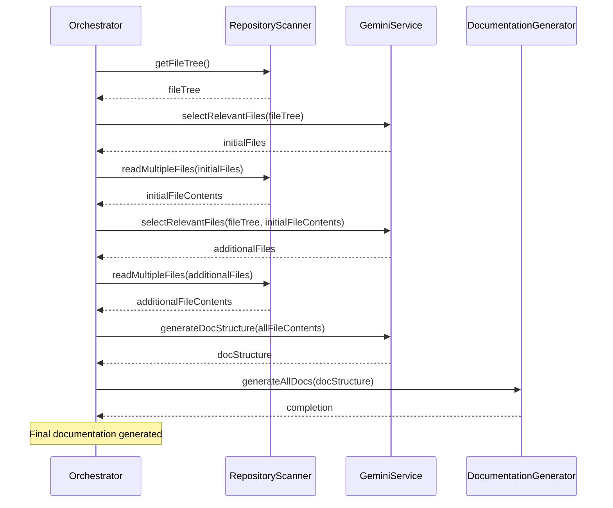

# Orchestrator
The [Orchestrator](/src/services/orchestrator.ts) class coordinates the documentation generation process. It initializes services, scans the repository, selects relevant files, generates a documentation structure, and finally, generates the documentation pages themselves.

## Responsibilities

The orchestrator is responsible for the following tasks:

*   Initializing the [RepositoryScanner](/src/services/repositoryScanner.ts), [GeminiService](/src/services/geminiService.ts), and [DocumentationGenerator](/src/services/documentationGenerator.ts).
*   Scanning the repository structure using the [RepositoryScanner](/src/services/repositoryScanner.ts).
*   Selecting relevant files for documentation using the [GeminiService](/src/services/geminiService.ts).
*   Generating a documentation structure using the [GeminiService](/src/services/geminiService.ts).
*   Generating documentation pages using the [DocumentationGenerator](/src/services/documentationGenerator.ts).

## Workflow

The orchestrator follows a specific workflow to generate documentation:

1.  **Initialization:** The orchestrator initializes the necessary services, including the [RepositoryScanner](/src/services/repositoryScanner.ts), [GeminiService](/src/services/geminiService.ts), and [DocumentationGenerator](/src/services/documentationGenerator.ts).
2.  **Repository Scanning:** The [RepositoryScanner](/src/services/repositoryScanner.ts) is used to obtain a file tree of the repository.
3.  **File Selection:** The [GeminiService](/src/services/geminiService.ts) selects relevant files for documentation based on the file tree.  This may occur in multiple rounds to refine the selection.
4.  **Documentation Structure Generation:** The [GeminiService](/src/services/geminiService.ts) analyzes the selected files and generates a documentation structure.
5.  **Documentation Generation:** The [DocumentationGenerator](/src/services/documentationGenerator.ts) uses the documentation structure and selected files to generate the documentation pages.



## Code Example

Here's a snippet of the [Orchestrator](/src/services/orchestrator.ts) class demonstrating the service initialization:

```typescript
const scanner = new RepositoryScanner(this.repositoryPath);
const gemini = new GeminiService(this.geminiApiKey);
await gemini.initialize();
const docGenerator = new DocumentationGenerator(this.outputDir, gemini, scanner);
```

This code initializes the [RepositoryScanner](/src/services/repositoryScanner.ts), [GeminiService](/src/services/geminiService.ts) and [DocumentationGenerator](/src/services/documentationGenerator.ts) with the configurations passed into the [Orchestrator](/src/services/orchestrator.ts).
